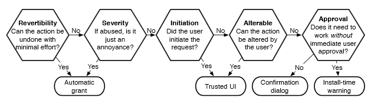

# Adding another permission? A guide

Nick Doty

This document was inspired by discussions at the [W3C Workshop on Permissions and User Consent](https://www.w3.org/Privacy/permissions-ws-2018/) held in September 2018

## Designing Web features with permissions

_So, you're thinking of adding a new permission prompt to the Web platform? Specification authors and feature designers may find this list of questions useful._

1. Is this feature important for the Web platform?

Specifically, is this feature important functionality that is consistent with the Web's model of privacy, security, accessibility and permissionless innovation? The Web need not be identical to every other software platform, and the distinctive features of the Web -- that software doesn't need to be vetted to operate, that documents and software co-exist, that users can be free from danger and intrusion when visiting a page, that interoperability is available among a wide range of devices and agents -- are essential to its ongoing success.

2. Does this feature require explicit permission?

Access to data, sensors and capabilities can be designed in a way that permissions are implicit. For example, drag-and-drop doesn't require interrupting the user to confirm whether they want to share a particular file -- instead, the user's action shows that they already want to provide access to a file onto a specific page/function. Can your feature be designed in this way?

(What about a "location picker" rather than a geolocation permission? User agents could implement an input type where the user selects either her current location or a named location that she has saved and often wants to search about.)

Follow @felt's diagram to determine whether an explicit permission is required. If this feature can be designed to have accountability and mitigations without prior permissions, that can reduce user fatigue without incurring irreparable harm.

3. What capabilities are implicated by the resource, sensor or functionality that you're adding?

Asking users to give permission to a piece of data they don't understand is not helpful. (Acronyms and various identifiers definitely fall into this category.) If the resource provides the site with a capability similar to some other resource or sensor, then there are reasons to consider this the same permission.

Consider also what can be inferred by access to a sensor or piece of personal data that may not be generally obvious. In the past, research has shown that accelerometer data might reveal typing, light sensors might reveal activity on other devices, photo files often include geolocation metadata.

4. What is the duration and persistence of your permission?

Different user agents may handle persisting permission in different ways. Considering duration and persistence ahead of time are useful, though. If a permission is requested for some future, ongoing or recurring functionality, then additional features are typically necessary for *accountability*, specifically:

* transparency: notice for ongoing, background or not-just-in-time actions can be challenging, but ambient notice and asynchronous notice are some options. Without that notice, a user who granted permission in the past and forgot (or someone else granted the permission on their device, or a device had multiple users, or the user previously made a decision in a different context) will not have effective means to update their choices.

* revocability: easy access to withdraw permission is generally useful but especially important in cases of ongoing permission.

5. How will users understand how collected personal data will be used, who has access to it, how long it will be retained and how they can access or delete it?

In the past, we have sometimes included in specifications the requirement that sites use their own expressive HTML to explain how a capability will be used and their choices regarding it prior to making a browser-mediated permission request. Our experience has shown this option to be very frequently ignored by sites, even when sites may be required by local laws to get such informed and specific consent.

_We believe ongoing research on this problem could help explore whether some purpose specification within permission-granting UI could be managed in a way that doesn't violate trust boundaries. For an example, see iOS._

6. What conditions are necessary for this new permission?

Typically, secure contexts are necessary in order for a user to know who is asking for a permission (otherwise, _who_ would also contain any set of network attackers).

Is this functionality only for top-level browsing contexts, or also for embedded third-party frames?

Does a permission grant background access or only when a tab is active/visible?

## How to ask for permission on the Web

_Web site authors using permissioned features should keep these principles in mind._

* Ask for permission in context and just in time.

* Progressive enhancement: ask for only the permission needed and prepare to gracefully handle cases where a capability is not available.

* Explain the implications of a permission before prompting the user, in a way that is accessible and localized.

    * _who_ is asking, _what_ are they asking for, _why_ do they need it?

* Users can and will change their minds. Don't assume that a permission granted once guarantees permanent access; nor that a permission refused means a user will never choose to accept some functionality.
